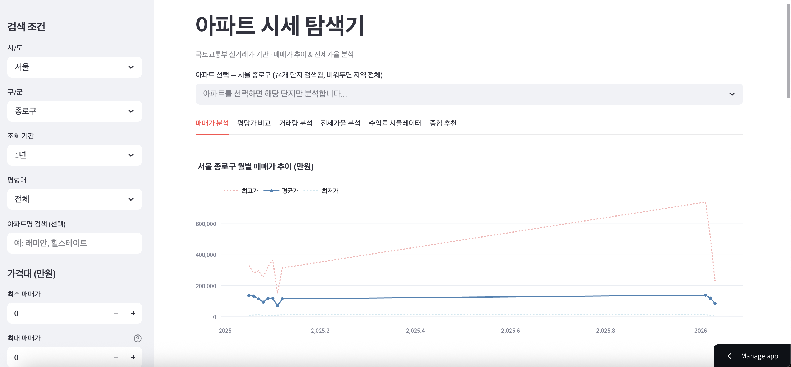
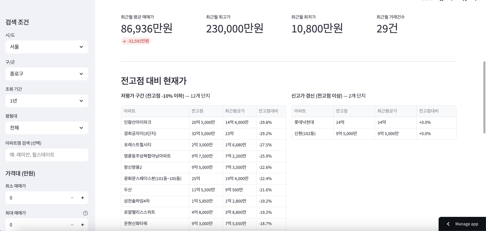
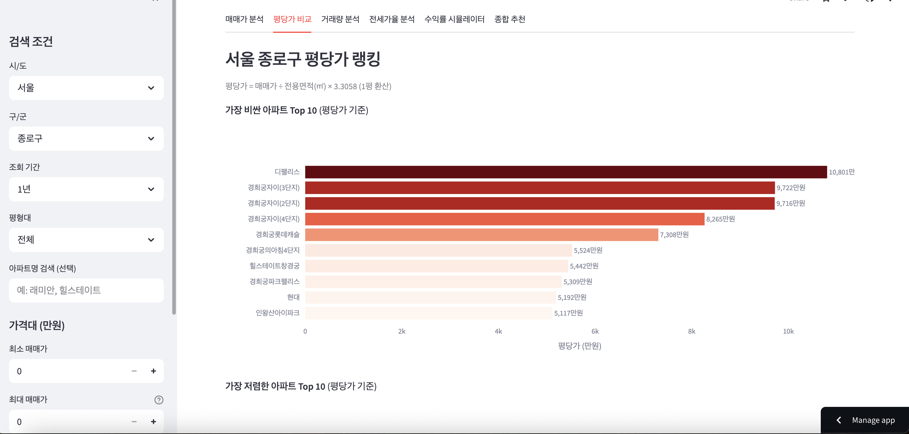

# 아파트 시세 탐색기

국토교통부 실거래가 공공 API 기반의 아파트 매매/전세 시세 분석 웹 애플리케이션입니다.

복잡한 부동산 데이터를 **직관적인 차트와 테이블**로 시각화하여, 누구나 쉽게 지역별 아파트 시세를 탐색하고 투자 판단에 필요한 핵심 지표를 확인할 수 있도록 만들었습니다.

---

## 이 프로젝트가 추구하는 것

- **데이터 기반 의사결정**: 감이나 뉴스가 아닌, 실제 거래 데이터에 기반한 객관적 시세 분석
- **진입 장벽 제거**: 부동산 초보자도 평당가, 전세가율, 수익률 등 핵심 지표를 한눈에 파악
- **종합 비교**: 단순 가격 조회를 넘어, 여러 지표를 스코어링하여 투자 후보를 추천

---

## 주요 기능 & UI

### 1. 매매가 분석

월별 매매가 추이(최고/평균/최저)를 라인 차트로 시각화합니다. 최근월 요약 메트릭(평균 매매가, 최고가, 최저가, 거래건수)과 전고점 대비 현재가 테이블을 함께 제공합니다.



**사용자가 볼 수 있는 것:**
- 월별 매매가 추이 차트 (최고가/평균가/최저가)
- 최근월 핵심 메트릭 4종 (평균 매매가, 최고가, 최저가, 거래건수)
- 전고점 대비 현재가 — 저평가 구간 vs 신고가 경신 단지 비교
- 거래 건수 Top 5 아파트
- 최근 거래 내역 상세 테이블



### 2. 평당가 비교

아파트별 평당가(매매가 / 전용면적 x 3.3058)를 랭킹으로 보여줍니다. 가장 비싼 Top 10과 가장 저렴한 Top 10을 수평 바 차트로 한눈에 비교할 수 있습니다.



**사용자가 볼 수 있는 것:**
- 평당가 Top 10 / Bottom 10 수평 바 차트
- 전체 평당가 테이블 (평균면적, 거래건수 포함)

### 3. 거래량 분석

거래량은 가격보다 먼저 움직이는 선행지표입니다. 월별 거래건수와 평균 매매가를 듀얼 축 차트로 비교하고, 전월 대비 변화율도 확인할 수 있습니다.

### 4. 전세가율 분석

전세가율(전세 보증금 / 매매가 x 100)로 갭투자 리스크를 시각적으로 판단합니다. 60% 미만 안전, 60~70% 주의, 70% 이상 위험으로 색상 구분됩니다.

### 5. 수익률 시뮬레이터

조회 기간 내 첫 거래가 대비 최근 거래가를 비교하여 아파트별 추정 수익률을 계산합니다. 투자금을 입력하면 예상 수익/손실을 시뮬레이션할 수 있습니다.

### 6. 종합 추천

5가지 지표(평당가, 전고점대비, 수익률, 전세가율, 거래량)를 100점 만점으로 스코어링하여 예산 범위 내 추천 아파트를 랭킹으로 제공합니다.

---

## 검색 조건 (사이드바)

왼쪽 사이드바에서 다양한 조건으로 데이터를 필터링할 수 있습니다:

| 조건 | 설명 |
|------|------|
| **시/도, 구/군** | 분석 대상 지역 선택 |
| **조회 기간** | 6개월 / 1년 / 2년 / 3년 |
| **평형대** | 전체, 소형(~60m2), 중소형(60~85m2), 중대형(85m2~) |
| **아파트명 검색** | 특정 아파트 키워드 필터 |
| **가격대** | 최소/최대 매매가 범위 설정 |

---

## 기술 스택

| 구분 | 기술 |
|------|------|
| **Frontend/Backend** | [Streamlit](https://streamlit.io/) |
| **데이터 처리** | Pandas |
| **차트 시각화** | Plotly |
| **데이터 소스** | 국토교통부 실거래가 공공 API (data.go.kr) |

---

## 설치 및 실행

### 1. API 키 발급

[공공데이터포털(data.go.kr)](https://www.data.go.kr/)에서 아래 두 API를 신청합니다:
- 국토교통부 아파트매매 실거래자료
- 국토교통부 아파트 전월세 자료

### 2. 설치

```bash
git clone <repository-url>
cd apt-research
python -m venv venv
source venv/bin/activate
pip install -r requirements.txt
```

### 3. API 키 설정

`.streamlit/secrets.toml` 파일을 생성합니다:

```toml
API_KEY = "발급받은_API_키"
```

### 4. 실행

```bash
streamlit run app.py
```

---

## 프로젝트 구조

```
apt-research/
├── app.py            # Streamlit 메인 애플리케이션 (UI + 분석 로직)
├── api.py            # 국토교통부 API 호출 및 데이터 파싱
├── config.py         # API 키 설정
├── lawd_codes.py     # 법정동 코드 매핑 (시/도 → 구/군 → 코드)
├── requirements.txt  # Python 의존성
└── docs/images/      # 스크린샷 이미지
```

---

## 면책 조항

이 도구는 공공 데이터를 기반으로 한 참고용 분석 도구입니다. 실제 투자 판단은 본인의 책임이며, 데이터의 정확성이나 최신성을 보장하지 않습니다.
